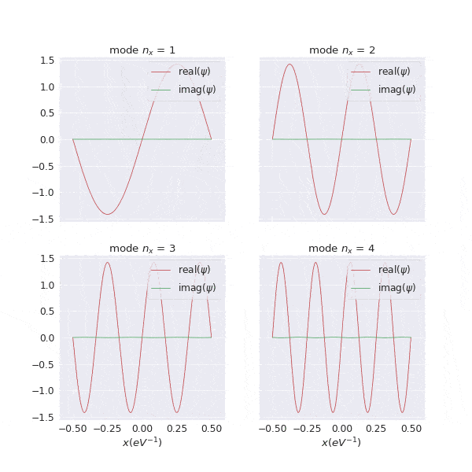
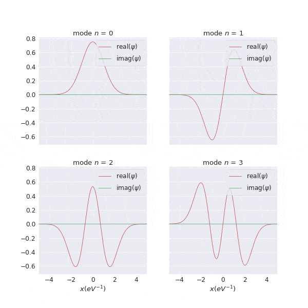
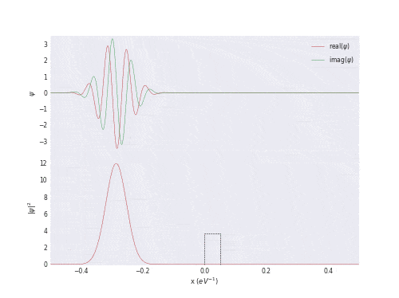

# VISUALIZING SCHRÖDINGER EQUATION


## The leapfrog method

To visualize the Schrödinger equation it has to be solved first. Here we use the leapfrog method,
also known as the midpoint method. The method is simple and very popular due to its good stability
when solving partial differential equations with oscillatory solutions.

If we have a differential equation

$$
\begin{equation}
y '(x) = f(x)
\end{equation}
$$

with $x$ in the range $[x_0, x_f]$, then we can discretize the interval and approximate the
differential equation with the [finite difference method]
(https://en.wikipedia.org/wiki/Finite_difference_method) using the leapfrog algorithm:

$$
\begin{equation}
\frac{y_{j+1} - y_{j-1}}{2\Delta x} = f_j + O(\Delta x^2)
\end{equation}
$$

with:

$$
\begin{align}
x_j &= x_0 + j\Delta x \\
y_j &= y(x_j) \\
f_j &= f(x_j)
\end{align}
$$

with $j = 0, ..., J$ and $J = (x_f - x_0) / \Delta x$. Soooooo defining a $\Delta x$ the number of steps $J$ is automatically defined.
If we have an equation that depends on $x$ and $t$ (like Schrödinger equation), then we define a $\Delta t$ and a $\Delta x$,
and the solution will be a 2-dimensional vector rather than a 1-dimensional vector, and we will write:

$$
\begin{align}
t_n &= t_0 + n\Delta t \\
x_j &= x_0 + j\Delta x \\
y^n_j &= y(t_n, x_j)
\end{align}
$$

## The Schrödinger equation

[This](https://wikimedia.org/api/rest_v1/media/math/render/svg/4894f9a205c471cb012351a1fccdd01285b6f11c) is the most general way of writing the Schrödinger equation.
However, we will make some assumptions. First of all, we will solve the equation for a particle in a 1D box. Then the Laplace operator is simply
$\nabla^2 \rightarrow \partial / \partial x^2$.

And we will work in [natural units](https://en.wikipedia.org/wiki/Natural_units) (NU), so that $\hbar = c = \kappa_b = 1$. Then the Schrödinger equation is written:

$$
\begin{equation}
i\frac{\partial}{\partial t} \Psi(t, x) = - \frac{1}{2m}\frac{\partial^2}{\partial x^2}\Psi(t, x) + V(x)\Psi(t, x)
\end{equation}
$$

In this case we will mess with a particle that we will trap in a 1D box of length 1. We will consider three different kinds of $V(x)$:

* $V(x) = 0$ (free particle)
* $V(x) = -k\,x^2$ (harmonic oscillator)
* $V(x) = V_0$ in an interval of width $d$, and $0$ otherwise (potential barrier)

## Solving the equation

To write the previous equation using finite-dfferences...

$$
\begin{align}
\frac{\partial}{\partial t} \Psi(t, x) &\approx \frac{\Psi^{n+1}_j - \Psi^{n-1}_j}{2\Delta t} &+ \; O(\Delta t^2) \\
\frac{\partial^2}{\partial x^2} \Psi(t, x) &\approx \frac{\Psi^{n}_{j+1} - 2\Psi^{n}_{j} + \Psi^n_{j-1}}{\Delta x^2} &+\; O(\Delta x^2)
\end{align}
$$

Aaaand we have finally our equation to solve:

$$
\begin{equation}
i\frac{\Psi^{n+1}_j - \Psi^{n-1}_j}{2\Delta t} = -\frac{1}{2m}\frac{\Psi^{n}_{j+1} - 2\Psi^{n}_{j} + \Psi^n_{j-1}}{\Delta x^2} + V_j\Psi^n_j
\end{equation}
$$

Now everything we have left to do is defining a 2D-vector (actually, 3 2D-vectors), and loop from ```n=0``` to ```n=N``` and we are done... BUT:
Is this equation stable for an arbitrary value of $\Delta x$ and $\Delta t$? It turns out that NO.

### Stability of the method

The previous equation has solutions of the type $\Psi^n_j = \xi^n e^{ikj\Delta x}$ for some $k$, where $\xi$ is a complex number. Replacing
$\Psi^n_j$ in the equation for this expression:

$$
\begin{equation}
i\frac{\xi - \xi^{-1}}{2\Delta t}\Psi^n_j = -\frac{1}{2m}\frac{2cos(k\Delta x) - 2}{\Delta x^2}\Psi^n_j + V_j\Psi^n_j
\end{equation}
$$

So $\Psi^n_j$ vanishes and we end up with:

$$
\begin{equation}
\xi - \xi^{-1} = -2i\Delta t\left( -\frac{1}{m\Delta x^2}(cos(k\Delta x) - 1) + V_j \right)
\end{equation}
$$

that is just a second-grade equation on $\xi$:

$$
\begin{equation}
\xi ^2 - 2i\Delta t\left( \frac{2}{m\Delta x^2}sin^2 \left(\frac{k\Delta x}{2} \right) + V_j \right) \xi - 1 = 0
\end{equation}
$$

where some half-angle identity has been used. The solution is

$$
\begin{equation}
\xi = i\Delta t\left( \frac{2}{m\Delta x^2} sin^2\left(\frac{k\Delta x}{2} \right) + V_j \right) \pm \sqrt{-\Delta t^2\left( \frac{2}{m\Delta x^2} sin^2\left(\frac{k\Delta x}{2} \right) + V_j \right)^2 + 1}
\end{equation}
$$

For the solution to be stable we need $\vert \xi \vert \le 1$ for any $k$, that is, that the solution does not disperse over the itarations. Looking carefully to
the previous equation it is easy to see that, in fact, this is true when the square root is a real number. Or, in other words, when
the factor inside the square root is greater than 0. Then, $\vert \xi \vert = 1$.

So, to sum up, given a $\Delta x$, the condition for $\Delta t$ to have stable solutions (for any value of $k$) is:

$$
\begin{equation}
\Delta t \le \frac{1}{\frac{2}{m\Delta x^2} + V_j}
\end{equation}
$$

For the harmonic oscillator, the max value for $V_j$ has been taken to define $\Delta t$ ($V_j \rightarrow -k\,(L/2)^2$).

## The program

(The [program](https://github.com/AniolSala/schrodinger_equation/blob/master/main.c) used to compute the solution of the Schrödinger equation is written in [C](https://www.quora.com/What-is-the-advantage-of-the-C-language-over-Python)).

Some explanation of how to turn the previous concepts into code is necessary.

As we mentioned before, to obtain the solution in the time step ```n+1``` we need not only the solution in the step ```n``` but also in the step ```n-1```. This means that,
once we have defined the initial conditions $\Psi^0_j,\,j=0, ..., J$, we need to get somehow the solution $\Psi^{-1}_j$. Unfortunately, using the leapfrog method $\Psi^{-1}_j$
can't be defined properly. Although it could be done a little bit more straightworward, to define $\Psi^1_j$ we used a simple finite-difference method:

$$
\begin{equation}
\frac{\Psi^1_j - \Psi^0_j}{\Delta t} = \frac{1}{2m}\frac{\Psi^0_{j+1} - 2\Psi^0_j + \Psi^0_{j-1}}{\Delta x^2} + V_j \Psi^0_j
\end{equation}
$$

But, didn't this approximation have an error of the order of $O(\Delta t)$? Well, yes, but it is just one step, so who cares.

In the main program we defined three 1D vectors of lenght ```nx``` (with ```nx``` being the number $N$ of intervals we devided our space interval, defined previously):

* ```psi2```, corresponding to the time step ```i+1```
* ```psi1```, corresponding to the time step ```i```
* ```psi0```, corresponding to the time step ```i-1```

Thus, if we want to solve, for example, the equation for a **free** particle that has an initial wave function corresponding to a sinusioidal function, we would have:

```C
// Define Psi(t=t_0, x)
for (unsigned j = 0; j < nx; j++) {
    x = -L / 2.0 + j * dx;
    psi0[j] = sqrt(L / 2.0) sin(M_PI * x / L);
}
// Define Psi(t=t_1, x)
for (unsigned j = 0; j < nx; j++) {
    psi1[j] = psi0[j] + (psi0[j+1] - 2.0 * psi0[j] + psi0[j-1]) * I * dt / (2.0 * m * dx * dx);
}
```


Where ```nt``` is the number of time steps and ```I``` is the imaginary unit.

For simplicity, we will confine the particle between $x=-L/2$ and $x=L/2$, which in practice means that we will force the solution to have the value $0$ in these points.
So, in the main loop, to get the value of ```psi2``` corresponding to $\Psi^{n+1}_j$:

```C
// Main loop that solves the equation
for (unsigned n = 2; n < nt; n++) {
    // Get the solution in the step t_n
    for (unsigned j = 1; j < nx - 1; j++) {
        psi2[j] = psi0[j] + (psi1[j+1] - 2.0 * psi1[j] + psi1[j-1]) * 2.0 * I * dt / (2.0 * m * dx * dx);
    }
    
    // Update the value of psi0 and psi1 for the next iteration
    for (unsigned j = 1; j < nx - 1; j++) {
        psi0[j] = psi1[j];
        psi1[j] = psi2[j];
    }
}
```


In the file [functions.c](https://github.com/AniolSala/schrodinger_equation/blob/master/functions.c), is has been defined the function ```slope``` that computes ```(psi1[j+1] - 2.0 * psi1[j] + psi1[j-1]) * 2.0 * I * dt / (2.0 * m * dx * dx)```.

Note that if $V(x) \neq 0$, then a term ```- 2.0 * I * dt * V_j * psi1[j]``` must be added in the loop where each ```psi1[j]``` is defined and in the main loop, where ```psi2[j]``` is calculated. For
example, for the harmonic oscillator, ```V_j = -k * x * x``` would be: ```- k * (-L/2.0 + j * dx) * (-L/2.0 + j * dx)```.

# Results

All the results have been obtained with a mass of ```m = 0```, and ```L = 1``` (except for the harmonic oscillator, that a value of ```L = 20``` has been taken),
with the value of ```x``` running between ```- L / 2.0``` and ```L / 2.0```.

### Free particle

For a free particle, $V(x) = 0$. In this case, the parameters have been taken:

* ```dx = 0.005```
* ```dt = m * dx * dx / 2.0```

The normal modes (this is, the wave functions that are eigenfunctions of the Hamiltonian operator, i.e. $\partial \Psi(t,x)\,/\,\partial t = \epsilon\,\Psi(t, x)$, where $\epsilon$ is the energy
of the state) for a free particle are sinusoidal functions:

$$
\begin{equation}
\Psi_n(t, x) = \sqrt{\frac{L}{2}}\,sin\left( n\frac{\pi\,x}{L} \right)\,\;\;n = 1,\,2,\,...
\end{equation}
$$

In fact, if we take the value for ```psi0[j]``` corresponding to the previous expression, with ```n = 1, 2, 3, 4```:



It is interesting to check that, for a normal mode, the modulus squared of the wave function remains constant in time:


However, for a mixed state $\sqrt{\frac{1}{2}}\,\Psi_1(t, x) + \sqrt{\frac{3}{10}}\,\Psi_2(t, x) +\sqrt{\frac{1}{5}}\,\Psi_4(t, x)$:


It is also interesting to see the time evolution of a wave packet. Unlike the [wave equation](https://en.wikipedia.org/wiki/Wave_equation), a
wave packet that propagates through space following the Schrödinger equation will disperse over time:


### Harmonic oscillator

The potential for a harmonic oscillator takes the form $V(x) = - k \,x^2$. For the next plots we took $k=1$ for simplicity. In this case, the parameters have been taken:

* ```dx = 0.01```
* ```dt = 1.0 / (2.0 / (m * dx * dx) - (0.5 * L) * (0.5 * L))```
* ```L = 20```

Unlike the free particle, the normal modes are the [Hermite polynomials](http://mathworld.wolfram.com/HermitePolynomial.html). These are the first four normal modes:



And, again, we see that the squared modulus of an eigenstate, for example the state for $n=2$:


is constant. And however, for a mixed state $\sqrt{\frac{1}{2}}\Psi_2(t, x) + \sqrt{\frac{1}{2}}\Psi_3(t, x)$:


### Finite potential barrier

In this case, the potential takes some value $V_0$ in a region of space, say between $x_0$ and $x_0 + d$, and is null out of this region. In the plots below,
we took $x_0 = 0$ and $d = L \,/\,20$.

The parameters used here are the next ones:

* ```dx = 0.01```
* ```dt = 1.0 / (2.0 / (m * dx * dx) + V0)```
* ```L = 1```

The interesting thing here is that, if we take a wave packet with enrgy $E = \langle H \rangle_\Psi$ lower than $V_0$, when the wave function collides with the barrier there
is a non-null probability that some part of this wave function crosses the barrier and passes to the other side. 

Here there is a barrier with energy $V_0 = 0.3\,E$ (the drawing of the barrier does not represent the actual value of $V_0$):



And here there is a barrier with energy $V_0 = 1.05\,E$. Althoug classically the *particle* does not have enough energy to pass the barrier, some part of its
wave function crosses it and reaches the right half of the box:


